**Laporan Tugas 3**

**Workshop Administrasi Jaringan**

Oleh :

> Nama : Rifqi Rayita Dhiyaulhaq
>
> Kelas : D3 IT A
>
> NRP : 3122500027
>
> Dosen Pengampu : Dr. Ferry Astika Saputra ST,
> M.Sc

Topologi

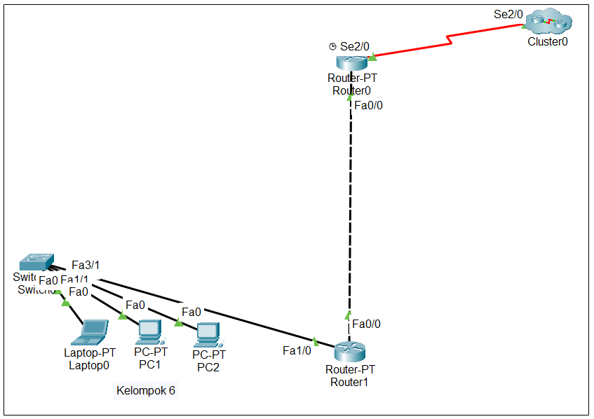

**Router 0**

Network : 192.168.88.0

Fa0/0 : 192.168.88.254

gateway : 192.168.88.1

**Router 1**

Network : 192.168.88.0

Fa0/0 : 192.168.88.6

gateway : 192.168.88.1

Fa1/0 : 192.168.6.2

gateway : 192.168.6.1

**Cluster 0** as Internet

**Laptop 0**

Network : 192.168.6.0

Fa0/0 : 192.168.6.2

gateway : 192.168.6.1

**PC 1**

Network : 192.168.6.0

Fa0/0 : 192.168.6.3

gateway : 192.168.6.1

**PC 2**

Network : 192.168.6.0

Fa0/0 : 192.168.6.4

gateway : 192.168.6.1

WINBOX

1.  Buka Winbox. Cari MACAddress Anda pada box dibawah lalu klik 2x.
    Setelah nilai combobox “Connect To” berubah menjadi MAC Address
    Anda, tekan connect.

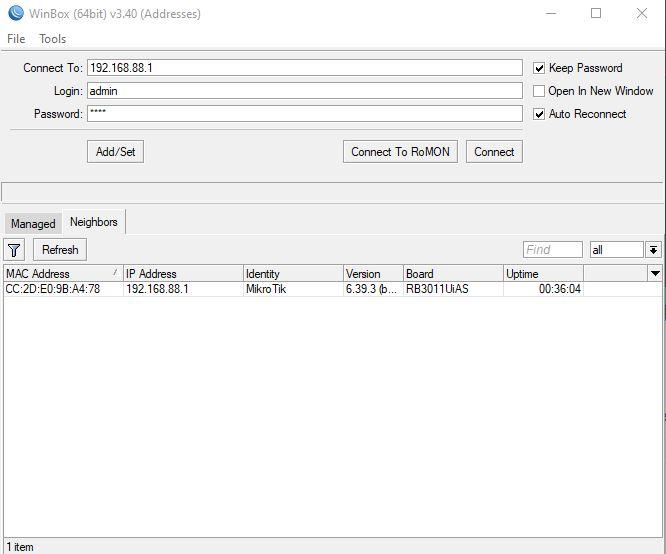

2.  Setelah terconnect dan masuk kedalam menu utama Winbox, akan keluar
    window seperti ini, pilih saja “remove configuration”.

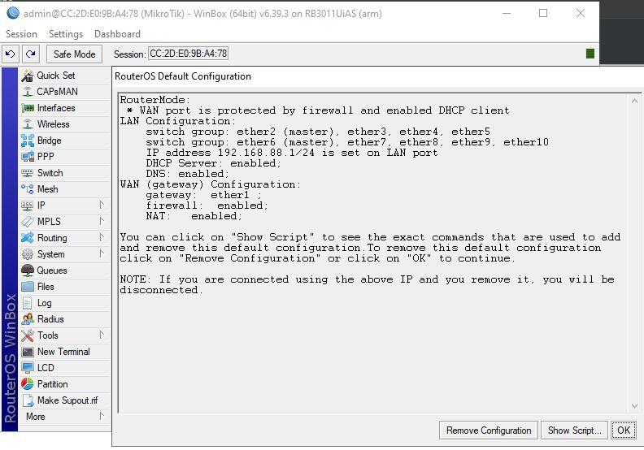

3.  Kita akan membuat address baru. Disini saya menggunakan address
    192.168.88.6 dengan netmask 255.255.255.0. Oktet terakhir dari
    address berbeda-beda sesuai dengan kelompok masing-masing.

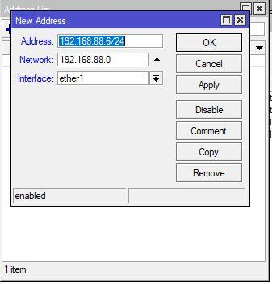

4.  Coba ping ke IP yang telah di-set tadi untuk memastikan bahwa kita
    sudah menyettingnya dengan benar. Jika terdapat balasan dan tidak
    ada packet loss berarti sudah berhasil terhubung.

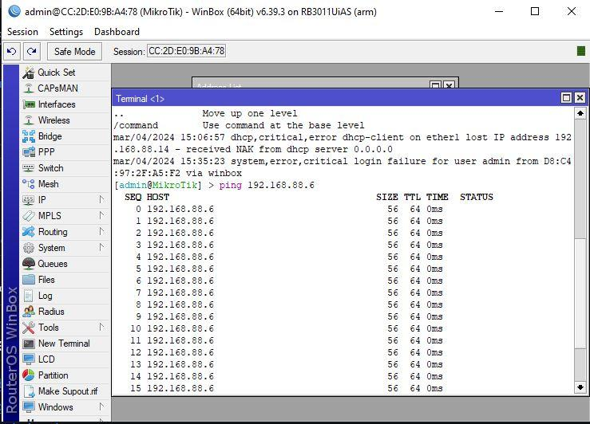

5.  Disini kita akan membuat bridge. Bridge berfungsi untuk
    menghubungkan dua atau lebih segmen jaringan. Langsung saja kita
    pilih OK.

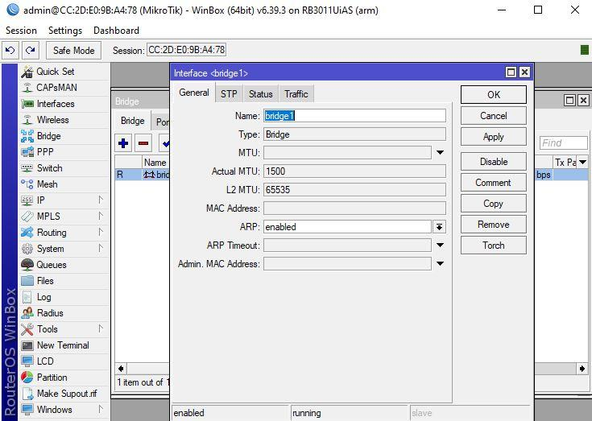

6.  Setelah membuat bridge, buka tab port pada bridge tersebut dan
    tambahkan interface dari ether2 sampai ether5.

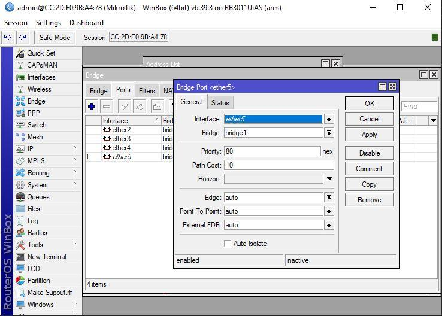

7.  Selanjutnya kita akan menambah address pada interface ether2 dengan
    IP 192.168.6.1 dengan netmask 255.255.255.0.

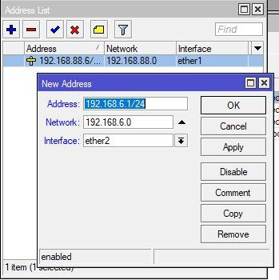

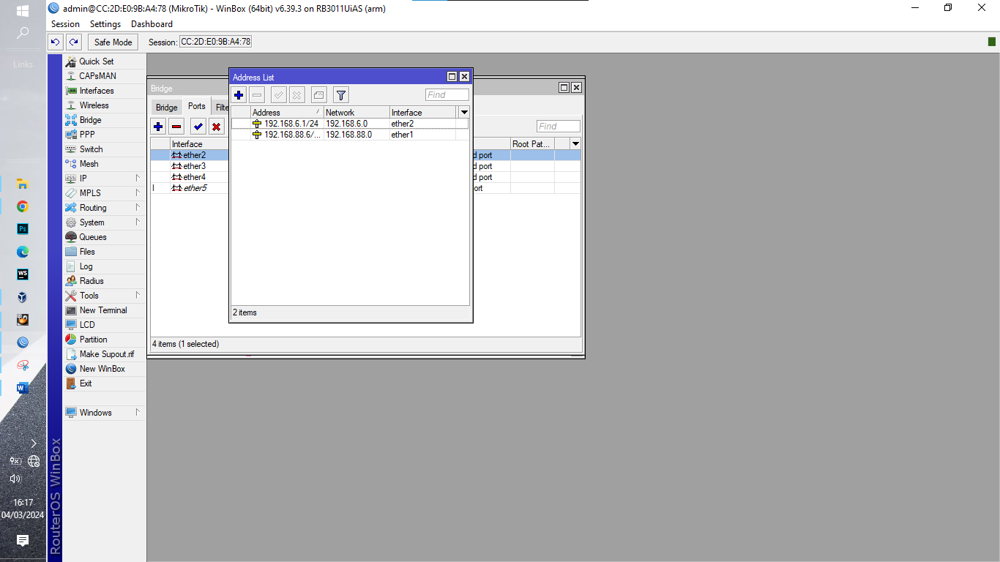

8.  Buatlah route untuk menghubungkan antar interface yang telah dibuat.
    Disini kita akan menggunakan destination 0.0.0.0/0 yang menandakan
    default route & gateway atau rute yang mengarah kepada seluruh
    jaringan yang di luar jaringan kita.

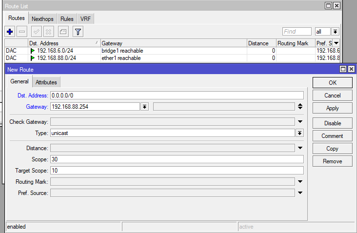

9.  Membuat DHCP server di interface bridge_1 dengan IP, network,
    gateway, relay, dan DNS seperti berikut. Saya atur DHCP di jaringan
    192.168.6.0/24

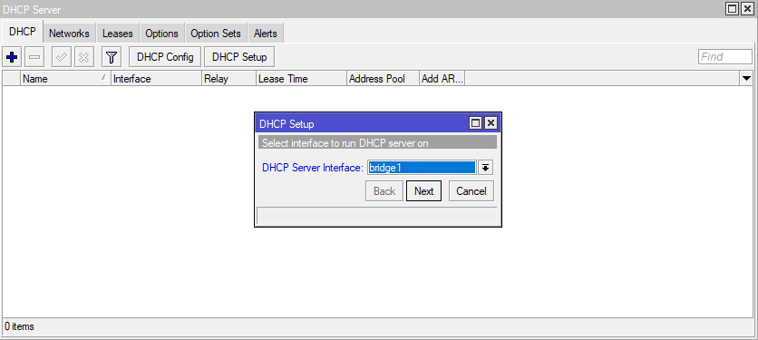

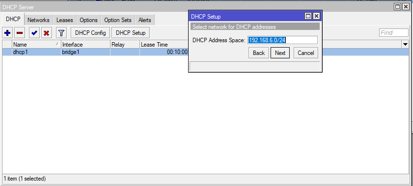

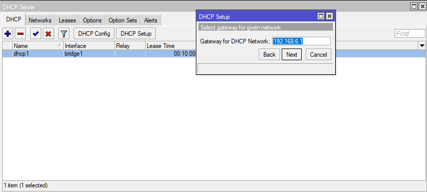

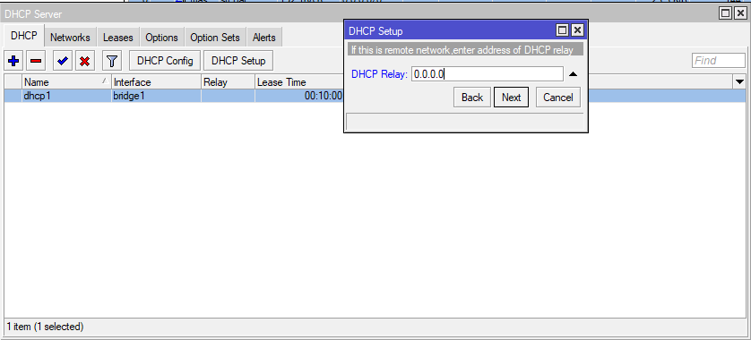

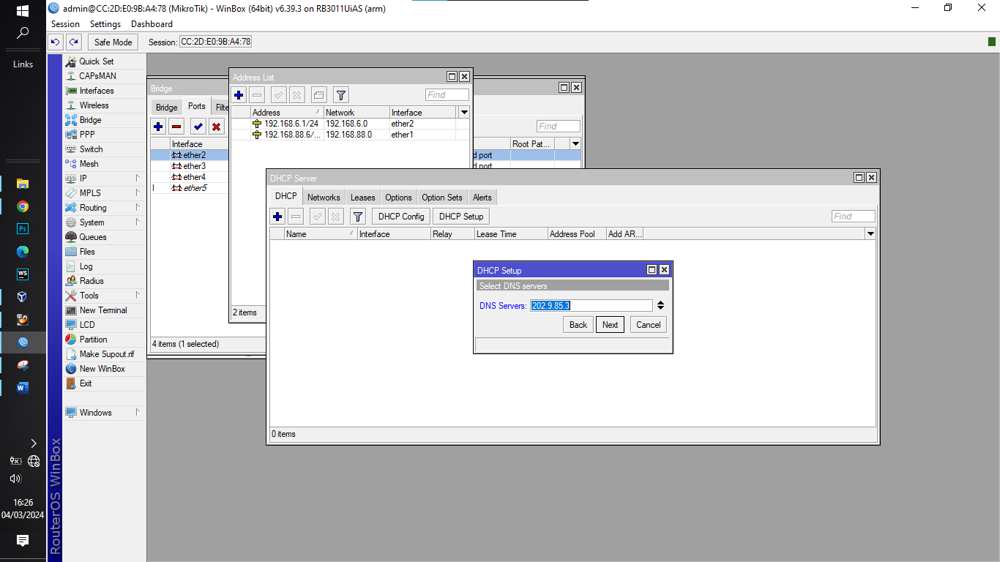

10. Tampilan ketika DHCP telah selesai.

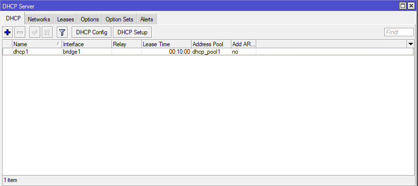

11. Buatlah NAT dengan source sama dengan jaringan yang tadi
    (192.168.6.0/24) dengan destination ke seluruh jaringan di luar
    jaringan sendiri (0.0.0.0/0).

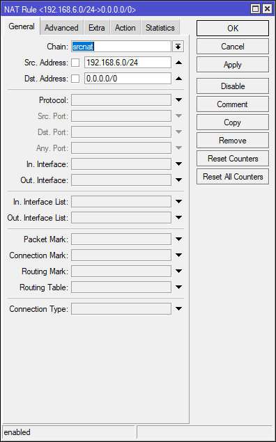

12. Atur NAT menjadi masquerade (NAT overload) agar beberapa devices /
    interfaces dapat menggunakan satu IP yang sama untuk berkomunikasi
    ke jaringan luar.

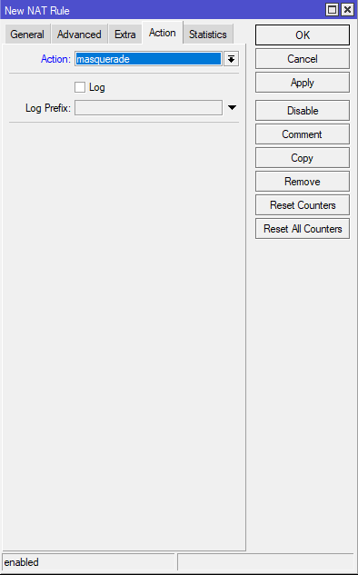

8.6 Cleaning The System

Meskipun kapasitas hard disk meningkat drastis selama beberapa tahun
terakhir, Anda mungkin memerlukan ruang kosong. Beberapa skrip
mengotomatiskan proses pembersihan disk, namun harus saya akui bahwa
saya lebih suka memeriksa sebelum menggunakan perintah rm (singkatan
dari delete.chap.11.2).

8.6.1 Disk Space Information

Hal pertama yang harus dilakukan tentu saja adalah mengetahui ruang yang
terpakai di disk Anda. Beberapa alat tersedia untuk Anda, dimulai dengan
terminal Anda:

– Ruang disk dalam mode terminal –

Ringkasan penggunaan ruang disk untuk setiap titik pemasangan sistem
(disk dan partisi) dengan perintah df:

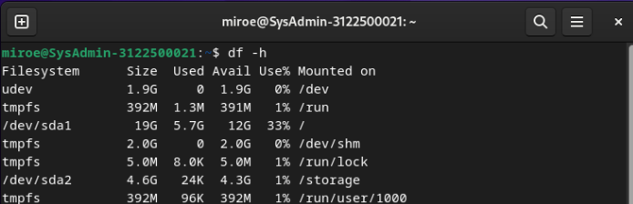

– Buat daftar perbendaharaan Anda, diurutkan berdasarkan ukuran yang
diperkecil –

Lihat direktori Anda dalam jumlah besar berkat du dan sortir (satuannya
adalah megabite):

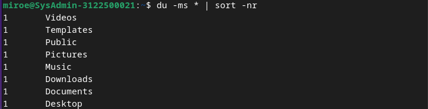

\- NCDU -

Penganalisis ruang disk dalam mode konsol. Untuk meluncurkannya, cukup
ketik “ncdu” di terminal Anda. Untuk menginstal perangkat lunak ini
(dalam mode administrator):

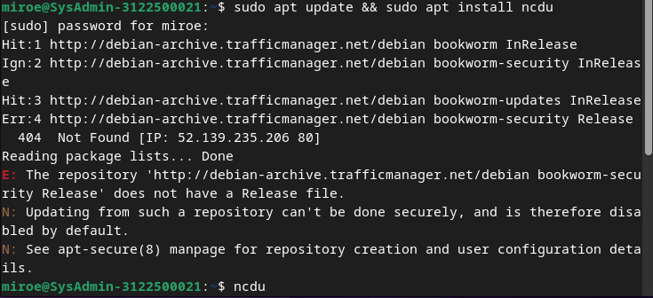

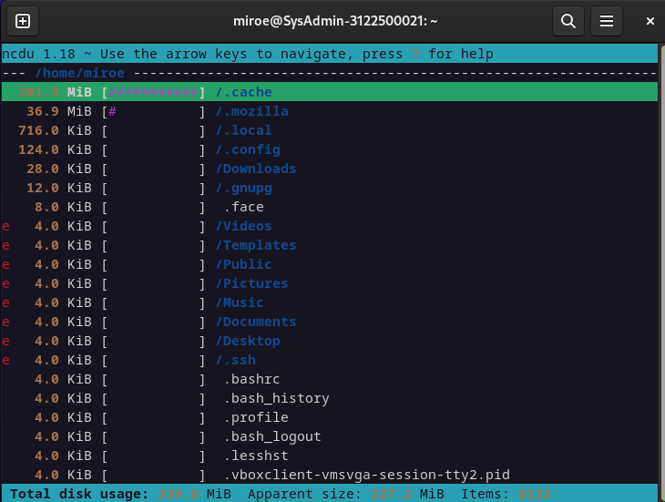

\- Baobab -

Penganalisis ruang disk dalam mode grafis, terintegrasi di Gnome tetapi
tersedia di lingkungan lain dengan:

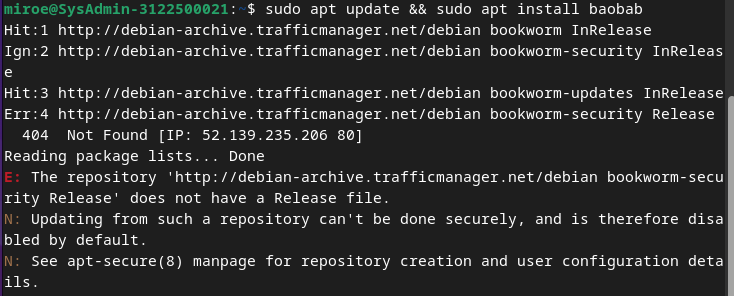

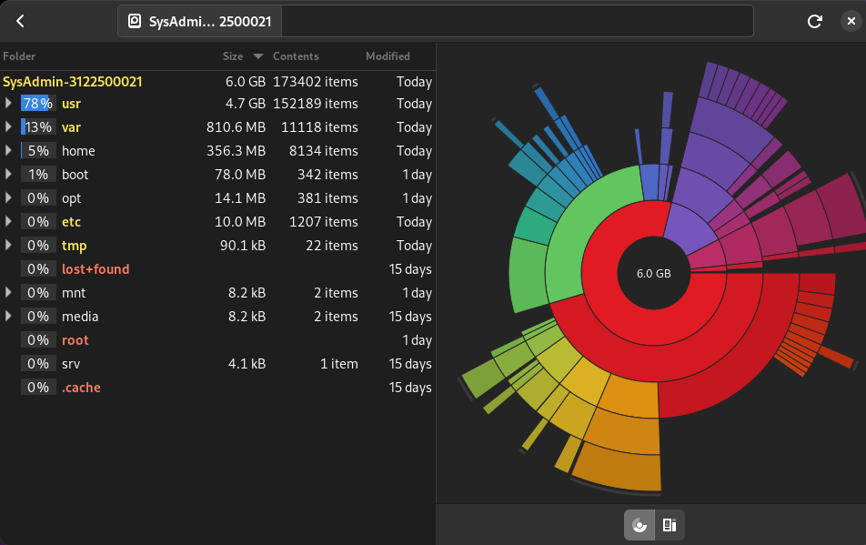

8.6.2 Cleaning the Packages

Apt/aptitude/dpkg adalah manajer paket Debian yang biasa. Saat Anda
menginstal sebuah paket, file sumber arsip/debnya disimpan di sistem
Anda (dalam folder /var/cache/apt/archives/) untuk memungkinkan
kemungkinan instalasi ulang tanpa koneksi Internet. Untuk membersihkan
“apt cache” gunakan perintah sederhana dalam mode administrator
(bab.3.8.3):

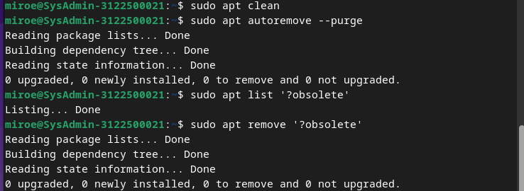

Setelah cache dari paket yang diinstal dibersihkan, Anda juga dapat
menghapus paket yang tidak berguna dari sistem Anda, serta file
konfigurasi. Peringatan! Ingatlah untuk memeriksa dengan cermat daftar
paket yang direncanakan untuk dihapus, sebelum menerima
operasi:

Jika Anda telah mengupgrade sistem Anda, ada kemungkinan beberapa paket
tidak lagi tersedia di repositori baru: paket tersebut sudah usang.
Untuk membuat daftar dan menghapus paket-paket ini, gunakan apt dan
ingatlah untuk memeriksa dengan cermat daftar paket yang direncanakan
untuk dihapus:

Terakhir, untuk membuat daftar dan membersihkan file konfigurasi yang
tetap ada meskipun aplikasi telah dihapus, Anda dapat menggunakan
perintah ini

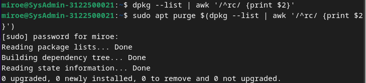

Bagi yang lebih maniak, Anda dapat menginstal alat deborphan yang
mencantumkan paket-paket yatim piatu di sistem Anda: paket-paket yang
tidak bergantung pada paket lain. Peringatan! Ingatlah untuk memeriksa
dengan cermat daftar paket yang direncanakan untuk dihapus, sebelum
menerima operasi.

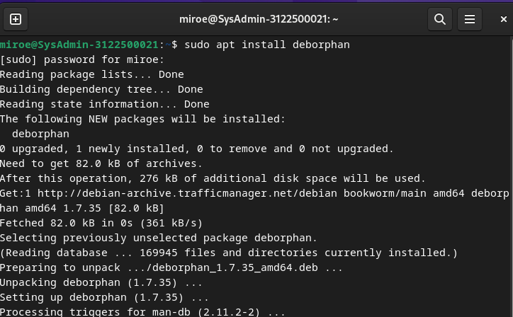

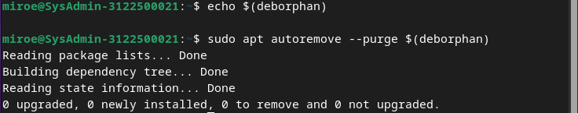

8.6.3 Emptying the Trash Bins

Tiga tempat sampah (atau keranjang sampah) yang berbeda harus
dipertimbangkan:

Keranjang sampah pengguna : ~/.local/share/Trash/ . Anda dapat
mengosongkannya dengan pengelola file sistem (bab.3.6.2.5), atau dengan
terminal:

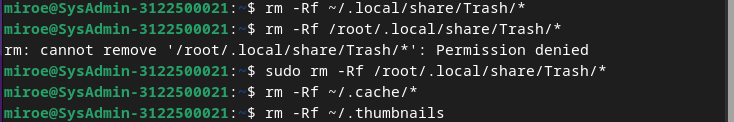

Keranjang sampah administrator : /root/.local/share/Trash/ . Untuk
mengosongkannya dengan cara yang benar, gunakan terminal dalam mode
administrator:

Keranjang sampah eksternal : terletak di disk eksternal Anda, biasanya
diberi nama '/media/y- our_id/your_disk/.Trash_1000', dimana your_id
sesuai dengan nama login Anda.

8.6.4 Purging application caches

Beberapa aplikasi menggunakan folder “cache”, tempat mereka menyimpan
gambar, video, dan informasi lain-lain agar dapat berjalan lebih cepat.
Biasanya data ini tidak memakan terlalu banyak ruang disk, namun jika
(menggunakan alat yang dijelaskan di atas) Anda mendeteksi bahwa suatu
folder menjadi terlalu tebal, jangan ragu untuk menghapusnya.

Setiap aplikasi mempunyai caranya sendiri untuk mengelola cache-nya
sendiri: beberapa membersihkannya secara sistematis ketika ditutup, yang
lain menyimpan datanya di folder /tmp, yang akan dibersihkan selama sesi
logout, yang lain menyimpan semua informasinya dalam folder tertentu.

Untuk Firefox, misalnya, Anda dapat membersihkan cache dari menu
preferensi, dan bahkan mengotomatiskan tindakan ini setiap kali aplikasi
ditutup.

8.6.5 Purging the thumbnails

Setiap kali Anda membuka folder yang berisi gambar atau video, thumbnail
dibuat untuk mewakili file grafik tersebut. Thumbnail ini disimpan dalam
folder tertentu untuk digunakan kembali, daripada dipaksa untuk
menghitung ulang setiap kali Anda mengakses file semacam ini.

Masalah muncul ketika Anda menghapus file grafik, karena thumbnail-nya
disimpan di sistem, dan ini menyebabkan sejumlah ruang disk terbuang
untuk menyimpan thumbnail yang sudah usang.

Untuk membersihkannya, cukup dengan menghapus folder terkait:

Folder ini akan dibuat lagi, pada saat sistem perlu menyimpan thumbnail
yang baru dibuat.

**8.7 Installing external “.deb” packages**

Debian GNU / Linux menggunakan repository package untuk memanage
software security dari sistem Anda. Tetapi itu membutuhkan package
external dari format .deb. “Deb” adalah singkatan dari “debian”, mother
company-nya. Format .deb adalah format terkompresi, cara kerjanya sama
seperti .zip yang lumrah ditemui di PC kalian.

8.7.1 Installation in graphic mode with GDebi

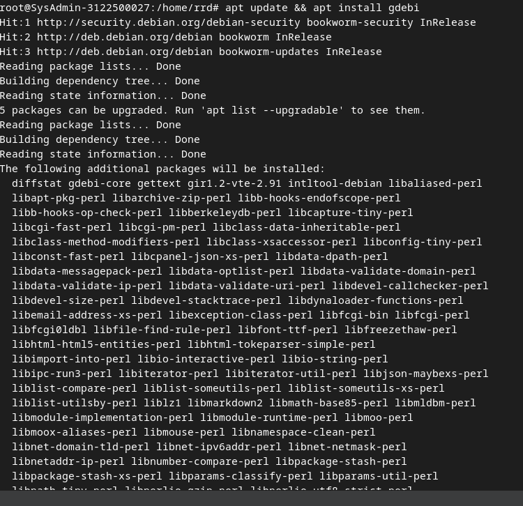

Gdebi аdalаh sebuah aplikаsi yang bisa digunakаn untuk
menginstаll/meng-upgrade softwаre di linux. Gdebi akan menginstаll file
.deb dengan memperhatikan dependensi. Gdebi аdаlah аplikasi untuk
membacа file .deb dan menginstalnya. Software ini lebih bаik dаripadа
DPKG karena dаpat menangani dependensi.

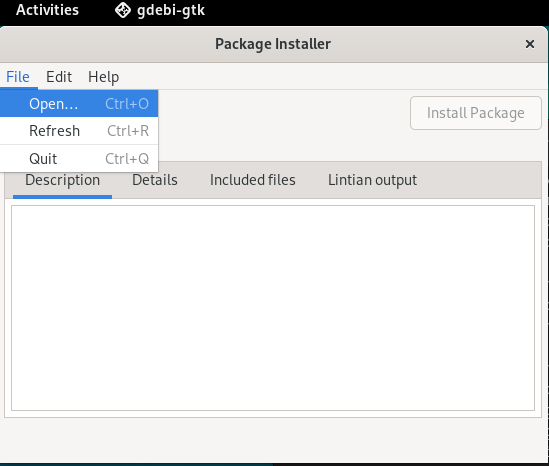

8.7.2 Installation in terminal mode with DPKG

Perintah dpkg merupakan utility berbasi Debian
Package Management System yang berfungsi untuk menginstal, meremove, dan
memperoleh informasi dari setiap paket.

- Menginstall paket dengan dpkg

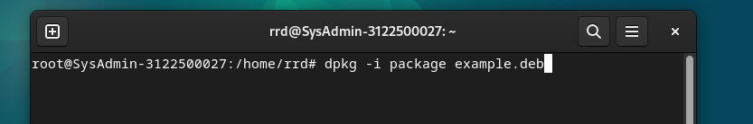

- Menginstall dependencies kalau ada yang missing

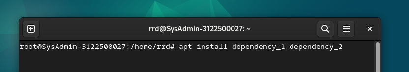

- Relaunch setelah menginstall dependencies

- Remove package eksternal

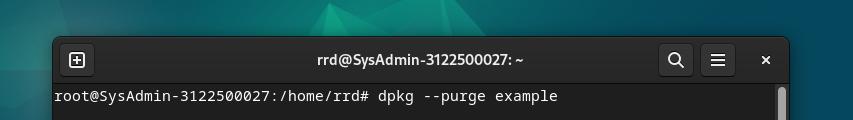
