**LAPORAN WORKSHOP ADMINISTRASI JARINGAN**

**  
**

**Disusun Oleh:**

**Muhammad Iqbal Rahmatullah D3 IT A /3122500014**

**Mohammad Ilham Ramadani D3 IT A /3122500021**

**Rifqi Rayita Dhiyaulhaq D3 IT A /3122500027**

**Dosen Pembimbing :**

**Dr. Ferry Astika Saputra ST, M.Sc**

Melakukan install NTP Client

1.  Lakukan instalasi paket layanan sinkronisasi waktu → sudo apt
    install systemd-timesyncd

> 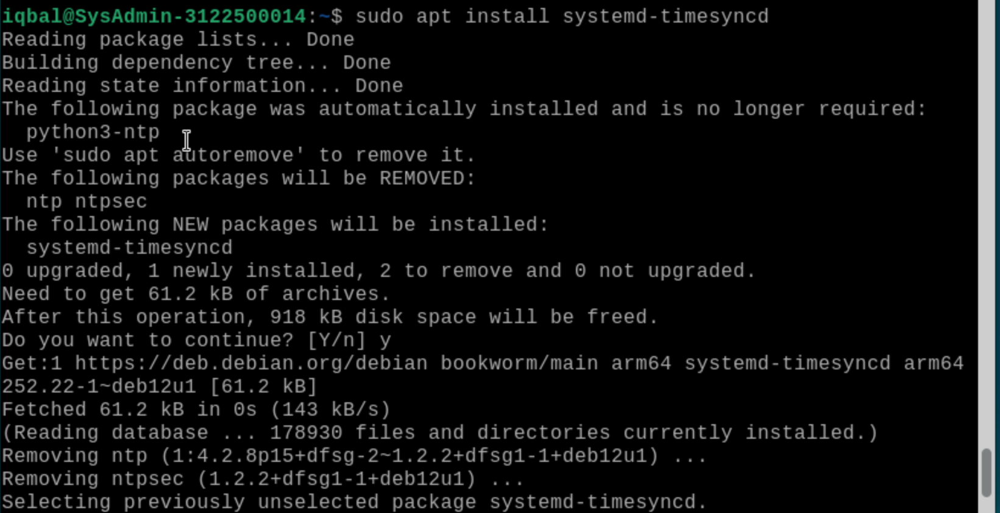 ="width:6.26772in;height:3.22222in" />
>
> Perintah untuk menginstal paket systemd-timesyncd, yang merupakan
> bagian dari systemd dan digunakan untuk sinkronisasi waktu pada sistem
> Linux.

2.  Melakukan konfigurasi timezone ke Asia/Jakarta → sudo timedatectl
    set-timezone Asia/Jakarta

>  ="width:6.26772in;height:0.38889in" />
>
> Command di atas digunakan untuk mengatur zona waktu menjadi
> Asia/Jakarta. Ini memastikan bahwa sistem menggunakan zona waktu yang
> benar.

3.  Melakukan konfigurasi Real Time Clock (RTC) untuk merefer ke UTC
    (Coordinated Universal Time) → sudo timedatectl set-local-rtc false

>  ="width:6.26772in;height:0.38889in" />
>
> Perintah ini mengatur RTC (Real-Time Clock) untuk tidak menggunakan
> waktu lokal. Ini umumnya disarankan untuk sistem yang dual-boot dengan
> Windows, yang biasanya menggunakan RTC lokal.

4.  Mengaktifkan NTP Client untuk sinkronisasi waktu → sudo timedatectl
    set-ntp true

>  ="width:6.26772in;height:0.34722in" />
>
> Perintah ini digunakan untuk mengaktifkan sinkronisasi waktu
> menggunakan NTP (Network Time Protocol), yang memungkinkan sistem
> untuk menyesuaikan waktu secara otomatis dengan server waktu
> eksternal.

5.  Menyunting file timesyncd.conf untuk mengarah ke NTP server terdekat
    untuk mendapatkan waktu delay terpendek. Biasanya setiap organisasi
    atau negara mempunyai NTP Server sendiri → sudo nano
    /etc/systemd/timesyncd.conf

>  ="width:6.26772in;height:3.81944in" />
>
> Command ini membuka file konfigurasi systemd-timesyncd menggunakan
> editor nano. Atur value dari NTP, NTP=0.id.pool.ntp.org.

6.  Restart layanan sinkronisasi waktu dan pastikan layanan berjalan
    dengan benar

> sudo systemctl restart systemd-timesyncd
>
> 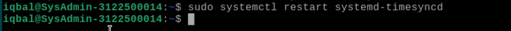 ="width:6.26772in;height:0.38889in" />
>
> Perintah ini digunakan untuk me-restart systemd-timesyncd setelah
> mengubah konfigurasinya. Ini memastikan bahwa perubahan konfigurasi
> diterapkan.
>
> sudo systemctl status systemd-timesyncd
>
>  ="width:6.26772in;height:2.38889in" />
>
> Perintah ini digunakan untuk memeriksa status systemd-timesyncd
> setelah restart. Ini berguna untuk memastikan bahwa layanan telah
> dimulai kembali tanpa masalah.
>
> Dapat dilihat status active(running)

7.  Lakukan pengecekan kesesuaian tanggal system dengan perintah →
    timedatectl

>  ="width:6.26772in;height:1.40278in" />
>
> Command ini digunakan untuk menampilkan informasi waktu dan tanggal
> saat ini, serta pengaturan zona waktu dan sinkronisasi waktu lainnya.

8.  Melihat hasil dengan sudo timedatectl
    timesync-status

>  ="width:6.26772in;height:2.41667in" />
>
> Perintah di atas digunakan untuk memeriksa status sinkronisasi waktu.
> Ini memberikan informasi tentang apakah sinkronisasi waktu sedang
> aktif atau tidak. Tujuan dari konfigurasi di atas adalah untuk
> mengatur dan mengonfigurasi waktu dan sinkronisasi waktu pada sistem
> Linux menggunakan systemd-timesyncd dan timedatectl.

Apache 2 + PHP-FM

1.  Install Apache2 → sudo apt -y install apache2

>  ="width:6.26772in;height:3.86111in" />
>
> Command ini digunakan untuk menginstal server web Apache HTTP. Opsi -y
> memungkinkan instalasi untuk berjalan tanpa interaksi pengguna dengan
> menyetujui semua pertanyaan konfirmasi.

2.  Melakukan konfigurasi Apache2

- sudo nano /etc/apache2/conf-enabled/security.conf

> 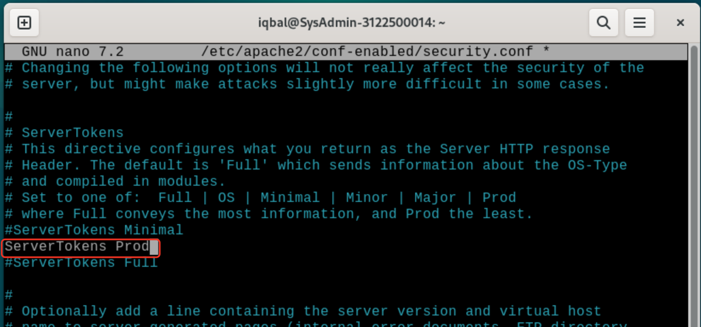 ="width:5.83854in;height:2.7156in" />
>
> Perintah ini membuka file konfigurasi security.conf dari Apache
> menggunakan editor nano. Tujuannya adalah untuk mengonfigurasi
> pengaturan keamanan untuk server web Apache, seperti mengaktifkan atau
> menonaktifkan modul keamanan atau menetapkan kebijakan keamanan.
> Tambakan ServerTokens Prod dibawah baris \#ServerTokens Minimal.

- sudo nano /etc/apache2/mods-enabled/dir.conf

>  ="width:5.51563in;height:0.79711in" />
>
> Command ini membuka file konfigurasi dir.conf dari Apache menggunakan
> editor nano. Tujuannya adalah untuk mengonfigurasi bagaimana Apache
> akan menangani permintaan direktori default, yaitu dalam urutan file
> apa yang akan disajikan ketika direktori tersebut diakses. Ubah baris
> value command menjadi “DirectoryIndex index.html index.htm”.
>
>  ="width:5.57813in;height:1.43623in" />
>
> Dengan hal yang sama ubah baris value command menjadi “DirectoryIndex
> index.html index.htm index php”.

- sudo nano /etc/apache2/apache2.conf

>  ="width:5.91146in;height:2.34691in" />
>
> Command ini membuka file konfigurasi utama apache2.conf dari Apache
> menggunakan editor nano. Tujuannya adalah untuk mengonfigurasi
> pengaturan umum untuk server web Apache, seperti pengaturan server,
> modul yang dimuat, dan pengaturan lainnya. Tambahkan spesifikasi nama
> server menjadi ServerName www.kelompok6.local

- sudo nano /etc/apache2/sites-enabled/000-default.conf

> 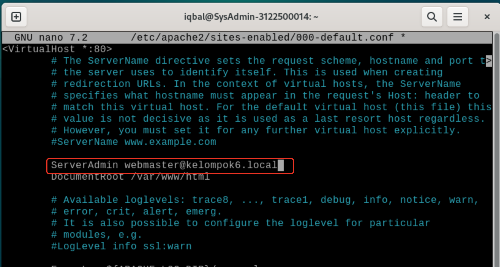 ="width:5.94271in;height:3.18853in" />
>
> Command ini membuka file konfigurasi 000-default.conf dari Apache
> menggunakan editor nano. Ini adalah konfigurasi situs default yang
> digunakan oleh Apache. Tujuannya adalah untuk mengonfigurasi
> pengaturan situs default, seperti alamat root dokumen, log, dan
> pengaturan lainnya. Ubah bagian webmaster's email menjadi “ServerAdmin
> webmaster@kelompok6.local”.

- systemctl reload apache2

>  ="width:5.86979in;height:0.38027in" />
>
> Perintah ini untuk me-reload konfigurasi Apache tanpa memulai ulang
> layanan. Tujuannya adalah agar perubahan konfigurasi yang dilakukan
> pada langkah-langkah sebelumnya diterapkan tanpa memengaruhi
> ketersediaan layanan web.

3.  Melakukan test ke web browser

> 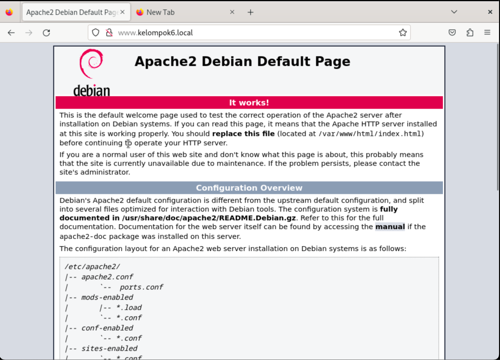 ="width:6.26772in;height:4.51389in" />
>
> Lakukan test langsung ke web browser dengan cara memasukkan alamat
> domain local dari konfigurasi yang sudah dilakukan. Jika sudah muncul
> tampilan Apache2 Debian Default Page maka anda sudah berhasil
> mengkofigurasinya. Secara keseluruhan, rangkaian command ini bertujuan
> untuk menginstal Apache HTTP server dan melakukan konfigurasi yang
> diperlukan untuk memastikan server web berjalan dengan pengaturan yang
> diinginkan.

Install PHP 8.2

1.  sudo apt -y install php8.2 php8.2-mbstring php-pear

>  ="width:6.26772in;height:3.88889in" />
>
> Perintah ini menginstal PHP versi 8.2 beserta modul mbstring dan paket
> tambahan PHP Pear. Tujuannya adalah untuk menginstal PHP dan modul
> yang diperlukan untuk menjalankan skrip PHP.

2.  mengecek php version → php -v

> 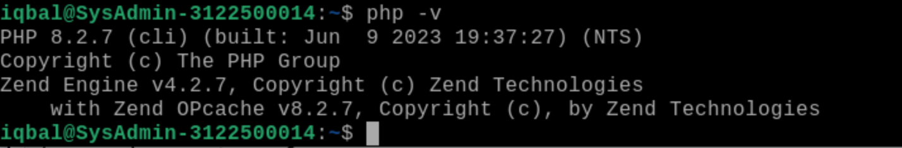 ="width:6.26772in;height:1.02778in" />
>
> Perintah untuk menampilkan versi PHP yang terinstal. Tujuannya adalah
> untuk memeriksa apakah instalasi PHP berhasil dilakukan dan untuk
> mengetahui versi PHP yang digunakan.

3.  verify installation to create a test script

> nano php_test.php
>
>  ="width:6.26772in;height:0.86111in" />
>
> Command ini membuka editor nano untuk membuat atau mengedit file
> bernama php_test.php. Tujuannya adalah untuk membuat atau mengedit
> skrip PHP yang akan digunakan untuk menguji konfigurasi PHP.
>
> Jalankan php php_test.php \| head
>
> 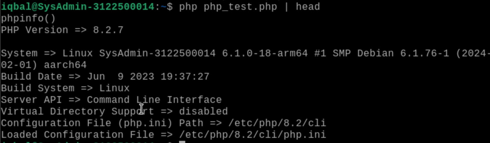 ="width:6.26772in;height:1.83333in" />
>
> Perintah ini mencoba mengeksekusi file php_test.php dan menampilkan
> beberapa baris pertama outputnya menggunakan perintah head.

4.  Install PHP-FM → sudo apt -y install php-fpm

>  ="width:6.26772in;height:3.36111in" />
>
> Command ini menginstal PHP-FPM (PHP FastCGI Process Manager), yang
> diperlukan untuk menjalankan PHP dengan Apache menggunakan FastCGI.
> Tujuannya adalah untuk menginstal PHP-FPM sebagai alternatif untuk
> menjalankan PHP.

5.  Mengkonfigurasi PHP-FM pada file konfigurasi Apache

> sudo nano /etc/apache2/sites-available/default-ssl.conf
>
>  ="width:6.26772in;height:2.68056in" />
>
> Perintah ini membuka file konfigurasi default-ssl.conf dari Apache
> menggunakan editor nano. Tujuannya adalah untuk mengonfigurasi situs
> default Apache dengan SSL.

- sudo a2enmod proxy_fcgi setenvif

>  ="width:5.74395in;height:1.10903in" />
>
> Command ini mengaktifkan modul Apache proxy_fcgi dan setenvif. Modul
> proxy_fcgi diperlukan untuk menghubungkan Apache dengan PHP-FPM,
> sedangkan modul setenvif diperlukan untuk mengatur variabel
> lingkungan.

- sudo a2enconf php8.2-fpm

> 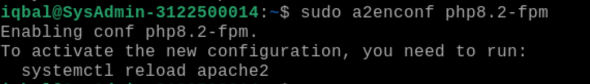 ="width:5.60938in;height:0.81066in" />
>
> Perintah ini mengaktifkan konfigurasi PHP-FPM untuk digunakan oleh
> Apache. Tujuannya adalah untuk memungkinkan Apache menggunakan PHP-FPM
> untuk mengeksekusi skrip PHP.

- sudo systemctl restart php8.2-fpm apache2

>  ="width:5.97396in;height:0.30763in" />
>
> Command ini me-restart layanan PHP-FPM dan Apache setelah
> mengonfigurasi mereka. Tujuannya adalah untuk menerapkan perubahan
> konfigurasi yang telah dilakukan.

6.  Melakukan test validasi terhadap PHP-FM dengan membuat file info.php
    di root document → sudo nano /var/www/html/info.php

> 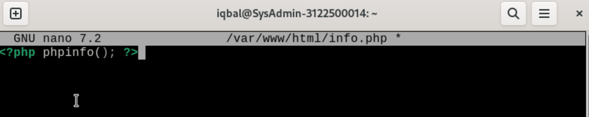 ="width:5.85938in;height:1.16798in" />
>
> Perintah ini membuka file info.php di direktori web root menggunakan
> editor nano. Tujuannya adalah untuk membuat file info.php yang akan
> menampilkan informasi konfigurasi PHP dan server web.

7.  Melakukan test di browser

>  ="width:6.26772in;height:4.51389in" />
>
> Jalankan web browser dan lakukan test dengan alamat domain sesuai
> kelompok dan tambahkan /info.php untuk menampilkan laman yang berisi
> tentang informasi php. Secara keseluruhan, rangkaian command ini
> bertujuan untuk menginstal PHP, mengkonfigurasi Apache untuk
> menggunakan PHP-FPM, dan membuat file info.php untuk menguji
> konfigurasi PHP dan server web.

MELAKUKAN INSTALL Database System : MariaDB

1.  sudo apt -y install mariadb-server

>  ="width:6.26772in;height:3.70833in" />
>
> Command ini menginstal server database MariaDB. Opsi -y memungkinkan
> instalasi untuk berjalan tanpa meminta konfirmasi tambahan dari
> pengguna.

2.  sudo nano /etc/mysql/mariadb.conf.d/50-server.cnf

>  ="width:6.26772in;height:3.95833in" />
>
> Command ini membuka file konfigurasi 50-server.cnf dari MariaDB
> menggunakan editor nano. Tujuannya adalah untuk mengonfigurasi
> pengaturan server MariaDB, seperti port default, pengaturan jaringan,
> dan parameter lainnya.

3.  sudo systemctl restart mariadb

>  ="width:6.26772in;height:0.34722in" />
>
> Perintah ini me-restart layanan MariaDB setelah mengubah
> konfigurasinya. Ini diperlukan agar perubahan konfigurasi diterapkan.

4.  Inisial Konfigurasi dan testing database MariaDB Server

- sudo mysql_secure_installation

>  ="width:5.52604in;height:3.27707in" />
>
> Mengisi beberapa pertanyaan ada di pdf  
>   
> Ini adalah script interaktif untuk mengamankan instalasi MariaDB. Ini
> akan memandu Anda melalui serangkaian langkah-langkah untuk
> meningkatkan keamanan server MariaDB, termasuk mengatur password root,
> menghapus pengguna anonim, menonaktifkan akses remote root, dan
> menghapus database pengujian.

- \# connect to MariaDB → sudo mysql

>  ="width:5.91146in;height:1.41404in" />
>
> Perintah ini digunakan untuk masuk MariaDB sebagai pengguna root. Ini
> memungkinkan Anda untuk melakukan administrasi database menggunakan
> perintah SQL.

- \[Unix_Socket\] authentication is enabled by default → show grants for
  root@localhost;

> 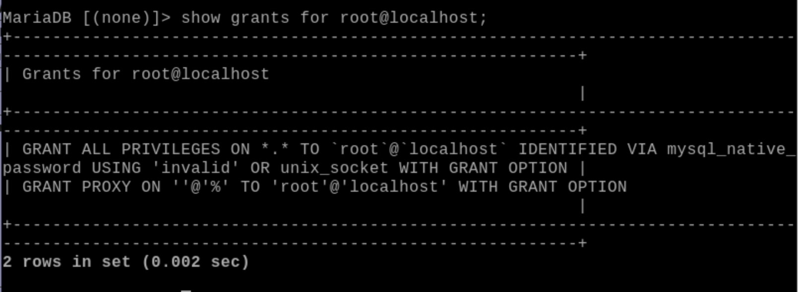 ="width:6.01751in;height:2.20908in" />
>
> Perintah SQL ini digunakan untuk menampilkan hak akses (grants) yang
> dimiliki oleh pengguna root untuk koneksi dari localhost. Ini berguna
> untuk memeriksa hak akses yang dimiliki oleh pengguna root.

- show user list → select user,host,password from mysql.user;

>  ="width:5.45313in;height:1.44934in" />
>
> Perintah SQL yang digunakan untuk menampilkan informasi pengguna
> MySQL/MariaDB yang ada, termasuk nama pengguna, host, dan password
> terenkripsi. Ini memberikan gambaran tentang pengguna yang ada dan
> pengaturan keamanan yang mungkin perlu ditinjau kembali.

- \# show database list → show databases;

>  ="width:5.81771in;height:1.59455in" />
>
> Command untuk melihat databases apa saja yang ada pada MariaDB.
> memungkinkan pengguna membuat, mengedit, dan menghapus tabel.

- \# create test database → create database test_database;

> 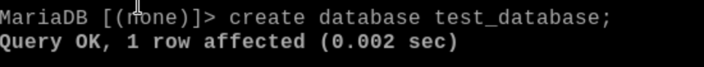 ="width:5.82813in;height:0.55183in" />
>
> Command yang ditujukan untuk membuat database dengan nama yang bisa
> disesuaikan, disini saya mengisi dengan nama test_database.

- \# create test table on test database → create table
  test_database.test_table (id int, name varchar(50), address
  varchar(50), primary key (id));

> 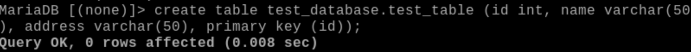 ="width:5.89063in;height:0.44033in" />
>
> Command berikut adalah cara untuk membuat tabel dengan kolom yang
> dibutuhkan oleh pengguna. Memungkinkan pengguna dapat menyesuaikan
> nama tabel dan kolom.

- \# insert data to test table → insert into
  test_database.test_table(id, name, address) values("001", "Debian",
  "Hiroshima");

>  ="width:5.74479in;height:0.45806in" />
>
> Command untuk memasukkan data sesuai dengan kolom yang ada pada tabel.
> Pastikan untuk menyesuaikannya dengan kolom pada tabel.

- \# show test table → select \* from test_database.test_table;

>  ="width:5.75521in;height:1.13766in" />
>
> Command yang digunakan untuk melihat data yang ada pada tabel
> test_table dari database test_database.

- \# delete test database → drop database test_database;

>  ="width:5.77604in;height:0.53731in" />
>
> Command untuk memungkingkan pengguna membuang atau menghapus database
> yang sudah ada.

MELAKUKAN INSTALL PHPMYADMIN

1.  sudo apt install phpmyadmin

> Command ini menginstal aplikasi manajemen basis data PHPMyAdmin.
> PHPMyAdmin adalah alat grafis berbasis web yang memungkinkan pengguna
> untuk mengelola basis data MySQL atau MariaDB melalui antarmuka web.

2.  pilih Apache2 sebagai web server

>  ="width:6.26772in;height:2.15278in" />

3.  Choose the option Yes to configure the database for phpmyadmin by
    itself using bdconfig-common,

> 

4.  Masukkan password phpmyadmin

>  ="width:6.26772in;height:1.81944in" />
>
>  ="width:6.26772in;height:3.66667in" />
>
> Konfigurasi phpmyadmin mulai dari memilih web server, configure the
> database for phpmyadmin, dan password untuk memulai menggunakannya.

5.  Create Apache Configuration for phpMyAdmin → sudo nano
    /etc/apache2/apache2.conf

>  ="width:6.26772in;height:3.86111in" />
>
> Perinta ini untuk membuka file konfigurasi apache2.conf dari Apache
> menggunakan editor nano. Tujuannya adalah untuk mengonfigurasi Apache
> untuk memuat konfigurasi PHPMyAdmin. Ini biasanya melibatkan
> menambahkan baris konfigurasi khusus ke file ini.

6.  Coba membuka phpmyadmin di web browser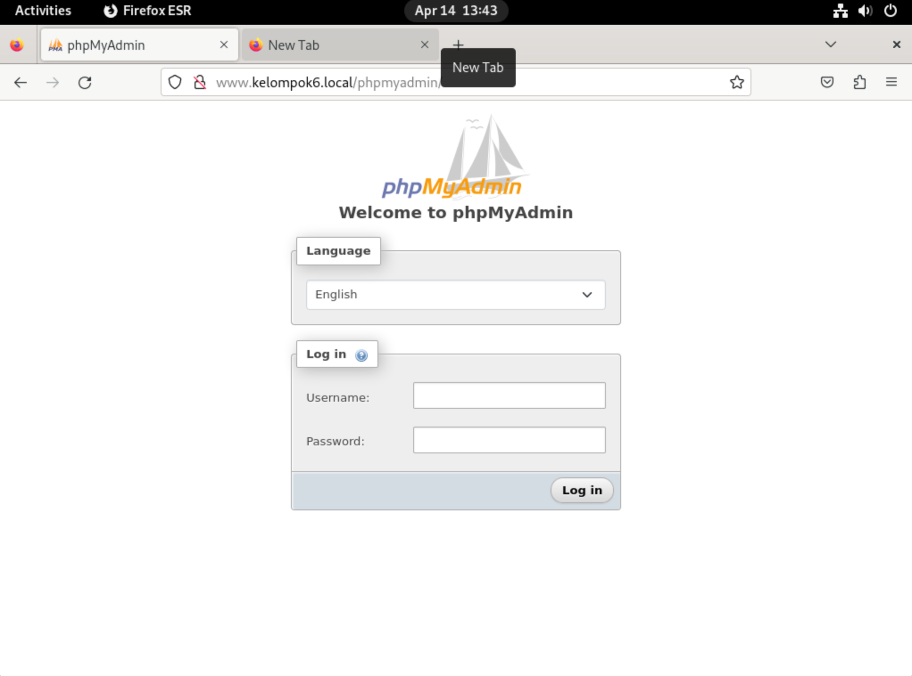

>  ="width:6.26772in;height:4.48611in" />
>
> Coba masuk web browser dengan alamat domain local ditambah dengan
> /phpmyadmin/. Kemudian masukkan username dan password untuk mulai
> menggunakan database.

7.  Menambahkan privillege ke user phpmyadmin

- Login ke mariadb → sudo mariadb -u root -p

- Lalu → GRANT ALL PRIVILEGES ON \*.\* TO 'phpmyadmin'@'localhost'
  IDENTIFIED BY 'password' WITH GRANT OPTION; FLUSH PRIVILEGES;

>  ="width:5.58854in;height:2.16301in" />
>
> Command ini membuka klien baris perintah MariaDB, meminta koneksi ke
> server MariaDB menggunakan pengguna root, dan meminta password untuk
> pengguna tersebut. Ini memberikan akses ke konsol MariaDB untuk
> melakukan operasi database melalui baris perintah.

- GRANT ALL PRIVILEGES ON \*.\* TO 'phpmyadmin'@'localhost' IDENTIFIED
  BY 'password' WITH GRANT OPTION;: Ini adalah perintah SQL yang
  memberikan semua hak akses ke seluruh basis data dan tabel untuk
  pengguna 'phpmyadmin'@'localhost'. Ini juga memberikan opsi GRANT
  sehingga pengguna 'phpmyadmin' dapat memberikan hak akses kepada
  pengguna lain.

- FLUSH PRIVILEGES;: Ini adalah perintah SQL yang memuat ulang tabel hak
  akses dan menerapkan perubahan yang baru saja dibuat.

> 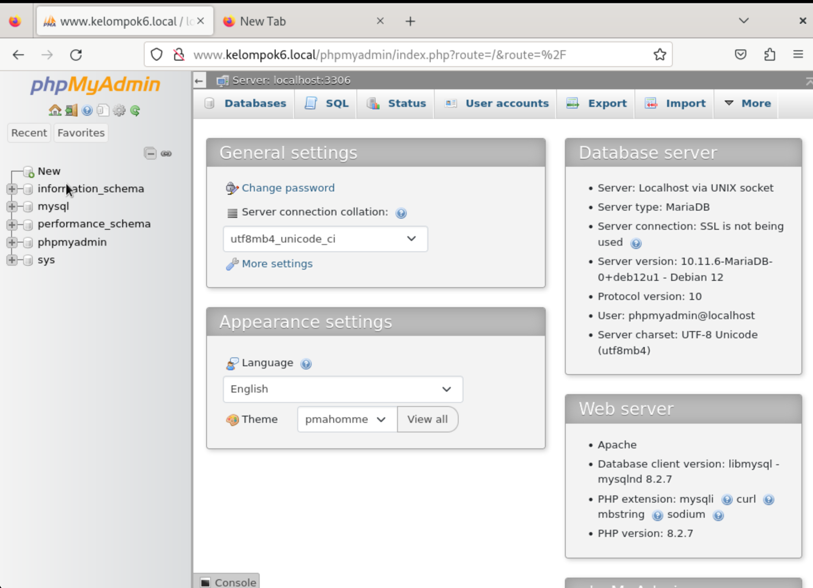 ="width:5.61979in;height:4.07015in" />
>
> Web broweser phpmyadmin siap untuk digunakan.

MELAKUKAN INSTALL Email System

POSTFIX : SMTP Server (TCP 25)

1.  sudo apt -y install postfix sasl2-bin

2.  Pilih no configuration

>  ="width:6.26772in;height:3.84722in" />

- Command untuk menginstall email dengan Postfix sebagai server SMTP
  pada port TCP 25.

- “No configuration” digunakan agar Postfix tidak melakukan config
  secara otomatis ketika diinstal.

3.  sudo cp /usr/share/postfix/main.cf.dist /etc/postfix/main.cf

>  ="width:6.26772in;height:0.34722in" />

- Command untuk mengcopy file config Postfix default dari direktori
  /usr/share/postfix/main.cf.dist ke /etc/postfix/main.cf

4.  sudo nano /etc/postfix/main.cf

> uncomment berikut
>
>  ="width:6.26772in;height:3.51389in" />

- Command untuk membuka file config Postfix yang sudah dicopy tadi.

- Baris kode tsb untuk menentukan user yang digunakan oleh Postfix.

>  ="width:6.26772in;height:3.41667in" />

- Baris tsb adalah nama host.

>  ="width:6.26772in;height:3.84722in" />

- Baris ini adalah domain default yang akan dipakai Postfix. Jika ada
  email address yang tidak mencakup domain, Postfix akan menganggapnya
  sebagai kelompok6.local

> 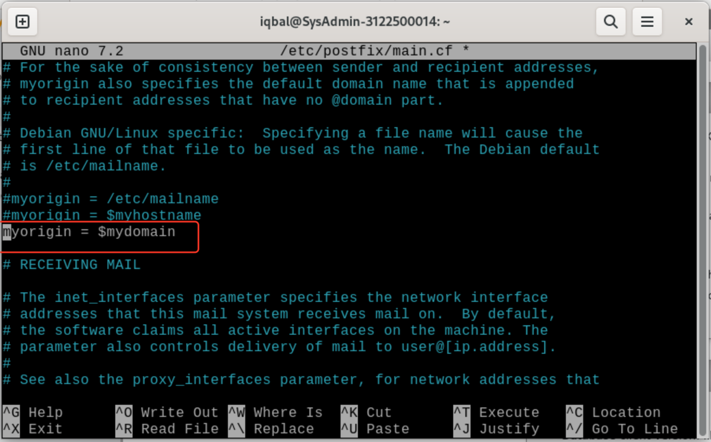 ="width:6.26772in;height:3.90278in" />

- Baris ini agar myorigin menggunakan isi atau value dari mydomain jika
  ada email address yang tidak menyertakan domain.

>  ="width:6.26772in;height:3.90278in" />

- Baris kode ini digunakan untuk mengirim email melalui semua interfaces
  yang ada pada server baik loopback maupun eksternal.

> 

- Command ini untuk memberitahu Postfix bahwa destinationnya adalah nama
  localhost, nama localhost dengan domain, loopback address, dan default
  domain.

> 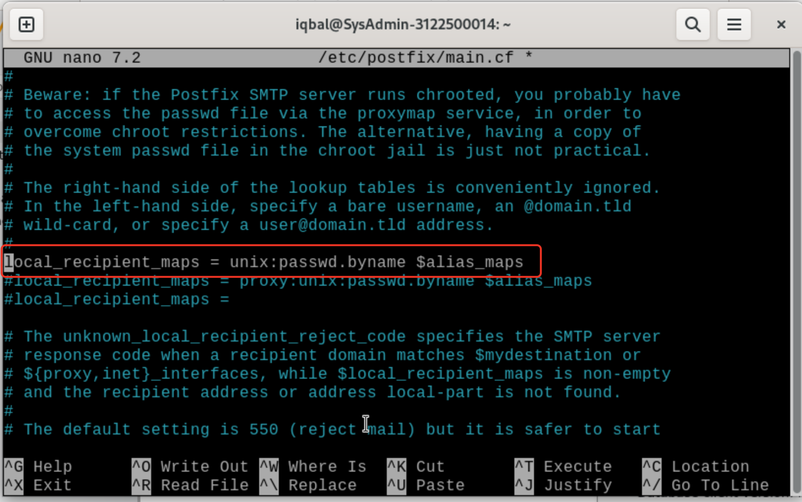 ="width:6.26772in;height:3.93056in" />

- Command ini berfungsi untuk bagaimana Postfix menentukan recipient
  dari email itu lokal atau bukan

- “unix:passwd.byname”: Untuk memeriksa direktori local user di sistem
  untuk menentukan apakah local atau bukan.

- \$alias_maps: alias map yang digunakan untuk mengonversi alias email
  ke email yang sebenarnya. Jika email address recipient adalah alias
  yang ditentukan pada alias map, maka email tsb dianggap sbg recipient
  local

>  ="width:6.26772in;height:3.88889in" />

- Command tersebut untuk mengatur jaringan internal agar sesuai dengan
  subnet pada IP address anda. Semisal IP 192.166.1.0/24 maka semua IP
  address pada subnet tersebut merupakan jaringan internal.

> 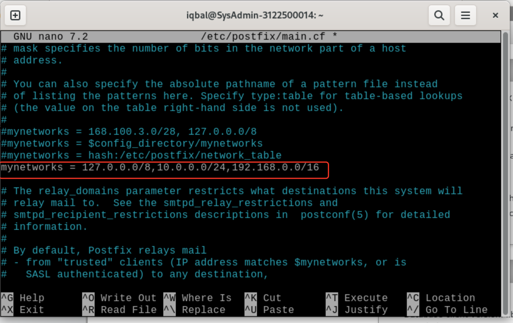 ="width:6.26772in;height:3.94444in" />

- Command tersebut berfungsi untuk mengkonfig daftar IP address yang
  dianggap sebagai jaringan internal Postfix.

>  ="width:6.26772in;height:3.86111in" />

- Command berikut menentukan direktori alias map yang akan digunakan
  oleh Postfix. Disini dapat terlihat bahwa yang dipakai adalah
  /etc/aliases

>  ="width:6.26772in;height:3.90278in" />

- Command ini berarti Postfix akan menggunakan direktori yang sama
  dengan alias map (/etc/aliases) sebagai databases alias.

>  ="width:6.26772in;height:3.86111in" />

- Command ini menentukan relative directory dimana mailbox user akan
  disimpan di sistem file.

>  ="width:6.26772in;height:3.91667in" />

- Command ini berfungsi untuk menentukan teks yang akan di display oleh
  server saat berinteraksi dengan client.

- \$myhostname: variabel yang akan diganti dengan nama localhost yang
  telah diconfig sebelumnya.

- ESMTP: Enhanced SMTP

>  ="width:6.26772in;height:2.31944in" />

- Command ini adalah untuk menentukan direktori ke biner Postfix yang
  digunakan untuk mengirim email oleh PHP atau aplikasi lain yang
  menggunakan sendmail.

> 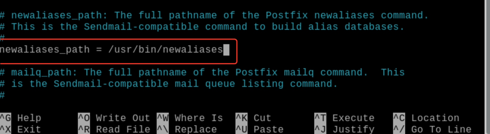 ="width:6.26772in;height:1.72222in" />

- Command ini adalah untuk menentukan direktori ke command ‘newaliases’
  yang digunakan untuk memperbarui databases alias saat ada perubahan
  file config alias.

>  ="width:6.26772in;height:0.86111in" />

- Command ini digunakan untuk menentukan direktori ke command ‘mailq’
  yang digunakan untuk menampilkan queue email yang tertunda pada server
  Postfix.

> 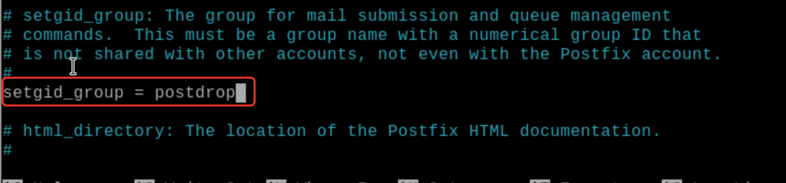 ="width:6.26772in;height:1.45833in" />

- Command ini menentukan grup yang akan digunakan oleh Postfix untuk
  menulis file di direktori queue email. Postdrop adalah nama grup yang
  akan digunakan.

>  ="width:6.26772in;height:1.08333in" />

- Command ini untuk menentukan direktori dimana file-file HTML untuk
  dokumen Postfix disimpan.

>  ="width:6.26772in;height:0.73611in" />

- Command ini untuk menentukan direktori dimana file-file manual / man
  untuk Postfix disimpan.

> 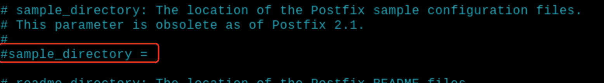 ="width:6.26772in;height:0.875in" />

- Command ini menentukan direktori dimana file-file sample atau contoh
  config untuk Postfix disimpan.

>  ="width:6.26772in;height:0.55556in" />

- Command ini menentukan direktori dimana file README untuk Postfix
  disimpan.

> 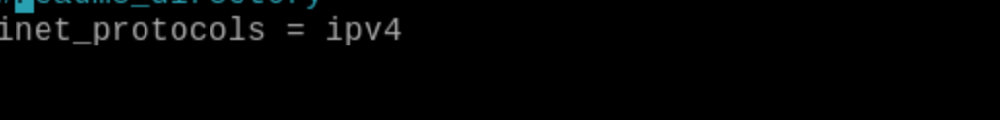

- Command ini digunakan untuk menentukan network protocol yang disupport
  oleh Postfix untuk mengirim dan menerima email.

>  ="width:6.26772in;height:3.97222in" />

- Command ini berisi pengaturan konfig tambahan untuk server email
  Postfix.

- “disable_vrfy_command= yes”: mengatur apakah perintah ‘VRFY’ harus
  dinonaktifkan atau tidak.

- “smtpd_helo_required = yes”: mengatur apakah client SMTP diharuskan
  memberikan perintah ‘HELO’ sebelum diizinkan untuk mengirim email.

- “message_size_limit= 10240000”: mengatur batas ukuran pesan email yang
  diterima oleh server (dalam byte).

5.  sudo newaliases

> 

- Command unutk membuat atau mengupdate database alias Postfix setelah
  ada perubahan dalam file config alias (/etc/aliases)

6.  systemctl restart postfix

>  ="width:6.26772in;height:0.40278in" />

- Commandini untuk restart service Postfix.

Menambahkan konfigurasi anti spam

1.  sudo nano /etc/postfix/main.cf

>  ="width:6.26772in;height:3.88889in" />

- Command ini berfungsi untuk client restrictions, sender restrictions,
  dan HELO restrictions pada server email Postfix.

- “permit_mynetworks”: Mengizinkan koneksi dari jaringan lokal
  (mynetworks)

2.  sudo systemctl restart postfix

>  ="width:6.26772in;height:0.41667in" />

DOVECOT : IMAP4 (TCP 143) and POP3 (TCP110) Server

Lakukan instalasi Dovecot Server

1.  sudo apt -y install dovecot-core dovecot-pop3d dovecot-imapd

> 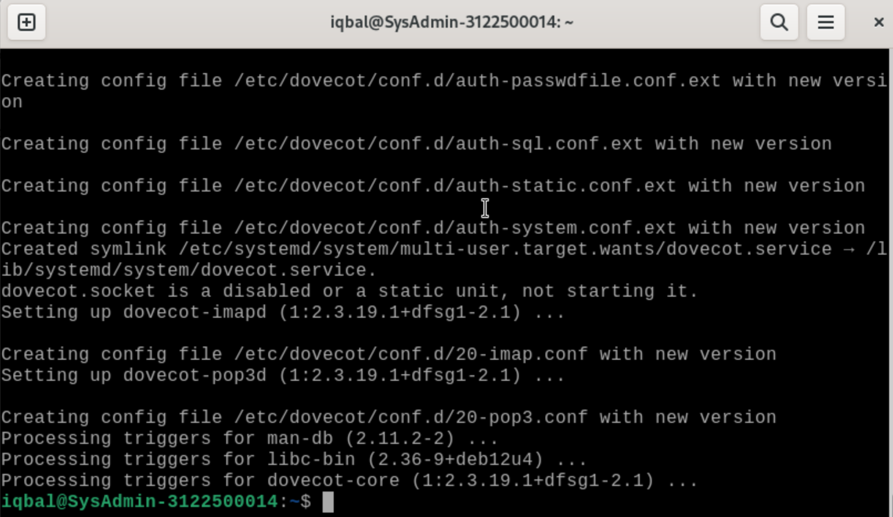 ="width:6.26772in;height:3.63889in" />

- Command ini digunakan untuk menginstal paket-paket Dovecot pada sistem
  Linux menggunakan APT.

- “dovecot-core”: core package Dovecot.

- “dovecot-pop3d”: POP3 untuk Dovecot

- “dovecot-imapd”: IMAP untuk Dovecot

2.  sudo nano /etc/dovecot/dovecot.conf

> 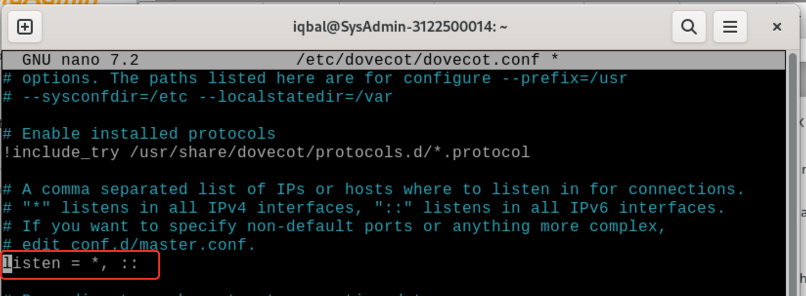 ="width:6.26772in;height:2.30556in" />

- Command ini menentukan network interface yang akan di-listen oleh
  server Dovecot

- “\*”: Dovecot akan mendengarkan semua IP address yang terhubung

- “::” Mewakili IPv6

3.  sudo nano /etc/dovecot/conf.d/10-auth.conf

>  ="width:6.26772in;height:2.59722in" />

- Command ini berfungsi untuk menonaktifkan otentikasi plaintext (tidak
  terenkripsi) user.

>  ="width:6.26772in;height:3.86111in" />
>
>  ="width:6.26772in;height:2.34722in" />

- Command ini berfungsi untuk menentukan mekanisme otentikasi yang
  diperbolehkan untuk pengguna yang terhubung ke server Dovecot. Ada dua
  mekanisme yaitu plain (tak terkenkripsi) dan login (encode)

4.  sudo nano /etc/dovecot/conf.d/10-mail.conf

>  ="width:6.26772in;height:2.43056in" />

- Command ini menentukan direktori penyimpanan mailbox user.

5.  sudo nano /etc/dovecot/conf.d/10-master.conf

> 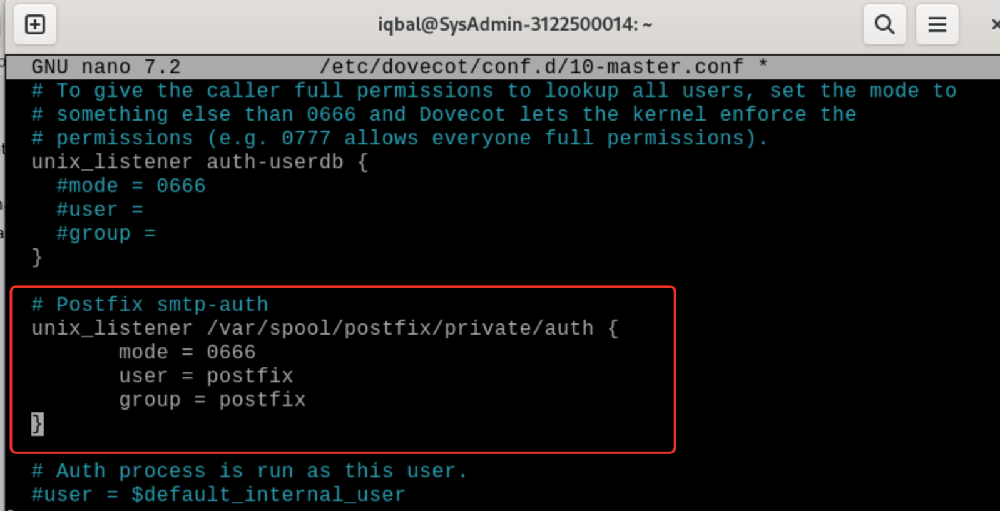 ="width:6.26772in;height:3.20833in" />

- Command ini berfungsi sebagai pengaturan config mekanisme otentikasi
  SASL pada Postfix

- Baris pertama: Postfix akan listen koneksi SASL di socket UNIX pada
  direktori /var/spool/postfix/private/auth.

- Baris kedua mengatur permissions pada socket Unix menjadi 0666, yang
  artinya dapat diakses oleh semua user

- Baris ketiga, menentukan pengguna sistem yang akan digunakan oleh
  socket Unix tersebut

- Baris keempat, menentukan grup sistem yang akan digunakan oleh socket
  Unix tsb

6.  sudo systemctl restart dovecot

>  ="width:6.26772in;height:0.40278in" />

FINAL CHECK untuk semua SERVICES :

netstat -a\| grep LISTEN

Melakukan Cek terhadap Layanan Posfix

telnet mail.kelompok6.local 25

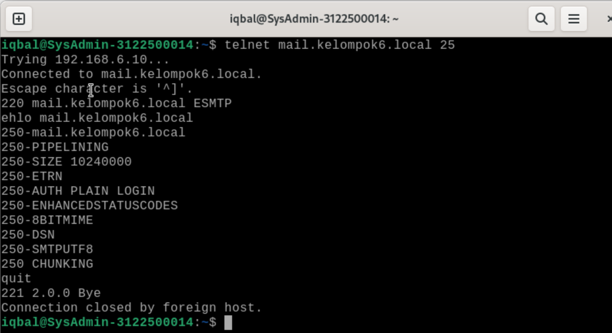

INSTALL THUNDERBIRD (EMAIL GUI CLIENT)

1.  flatpak install flathub org.mozilla.Thunderbird

>  ="width:6.26772in;height:3.72222in" />

2.  install thunderbird GUI on
    https://flathub.org/apps/org.mozilla.Thunderbird

> 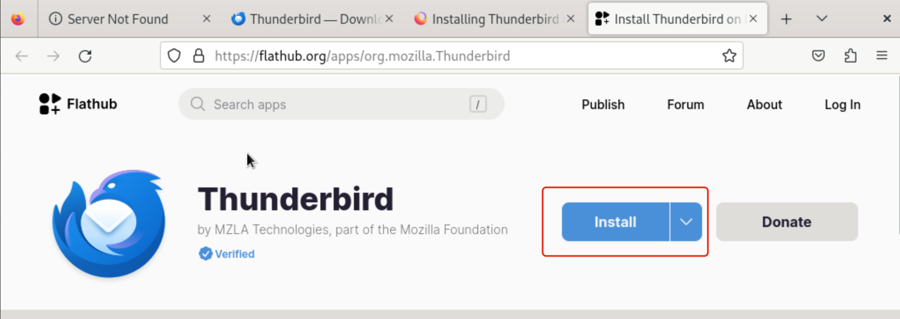 ="width:6.26772in;height:2.22222in" />

3.  Menambahkan 2 akun email

> 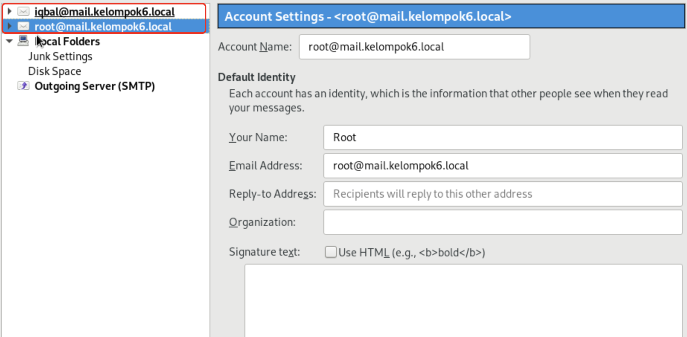 ="width:6.11979in;height:3.00907in" />

4.  Mencoba saling send email

>  ="width:6.26772in;height:3.59722in" />
>
> 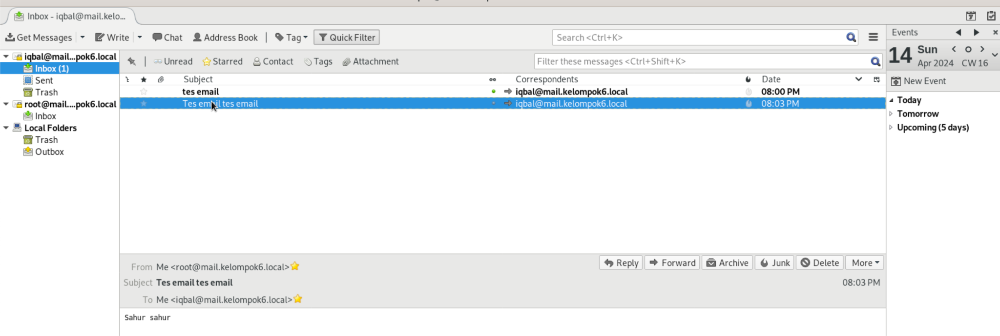 ="width:6.26772in;height:2.11111in" />

Install webmail (RoundCube)

1.  Create a Database for RoundCube

> 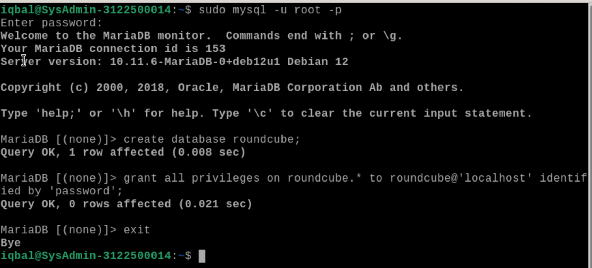 ="width:6.26772in;height:2.84722in" />
>
> Command ini membuka klien baris perintah MariaDB, meminta koneksi ke
> server MariaDB menggunakan pengguna root, dan meminta password untuk
> pengguna tersebut. Ini memberikan akses ke konsol MariaDB untuk
> melakukan operasi database melalui baris perintah.

- create database roundcube;: Ini adalah perintah SQL yang digunakan
  untuk membuat database bernama "roundcube" di server MariaDB.

- GRANT ALL PRIVILEGES ON roundcube.\* TO 'roundcube'@'localhost'
  IDENTIFIED BY 'password' ;: Ini adalah perintah SQL yang memberikan
  semua hak akses ke database "roundcube" kepada pengguna
  'roundcube'@'localhost'. Kata sandi 'password' adalah kata sandi yang
  diberikan untuk pengguna 'roundcube'.

2.  Install and Configure RoundCube

> sudo apt -y install roundcube roundcube-mysql
>
> 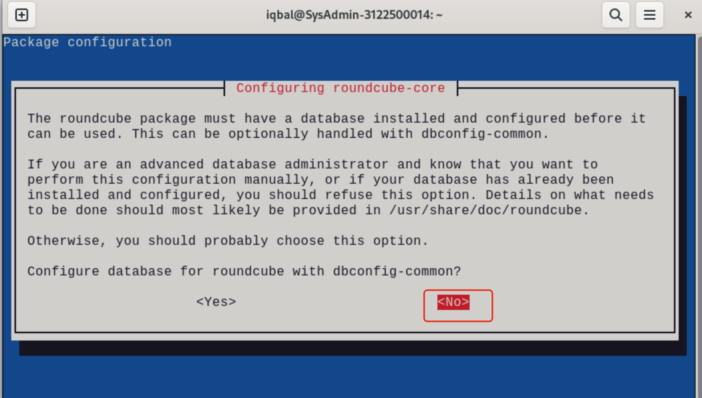 ="width:6.26772in;height:3.55556in" />
>
>  ="width:6.26772in;height:3.26389in" />
>
> sudo apt -y install roundcube roundcube-mysql: Command ini menginstal
> aplikasi webmail Roundcube dan modul MySQL yang diperlukan untuk
> Roundcube. Pilih no pada pertanyaan configure database for roundcube.

3.  cd /usr/share/dbconfig-common/data/roundcube/install

>  ="width:6.26772in;height:0.34722in" />
>
> Command ini mengubah direktori ke lokasi instalasi Roundcube.

4.  sudo mysql -u roundcube -D roundcube -p \< mysql dan masukkan
    password mariaDB roundcube (password)

> 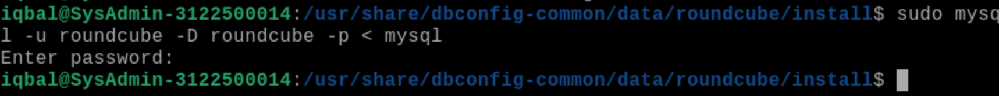 ="width:6.26772in;height:0.61111in" />
>
> Perintah untuk mengimpor skema database Roundcube ke dalam database
> "roundcube".

5.  sudo nano /etc/roundcube/debian-db.php

> 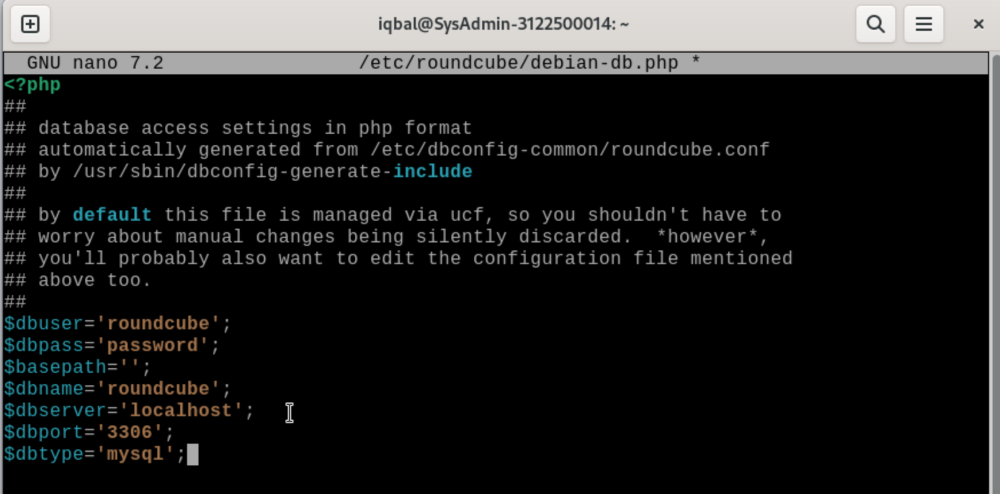 ="width:6.26772in;height:3.09722in" />
>
> Perintah ini membuka file debian-db.php dari Roundcube untuk diedit
> menggunakan editor nano. File ini berisi konfigurasi database untuk
> Roundcube.

6.  sudo nano /etc/roundcube/config.inc.php

> 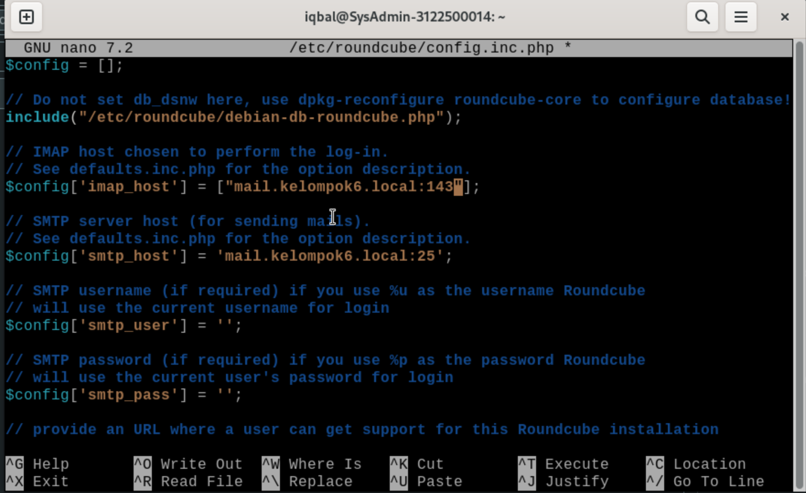 ="width:6.26772in;height:3.84722in" />
>
> Command ini membuka file konfigurasi config.inc.php dari Roundcube
> untuk diedit menggunakan editor nano. File ini berisi konfigurasi umum
> untuk aplikasi Roundcube.

7.  sudo nano /etc/apache2/conf-enabled/roundcube.conf

> 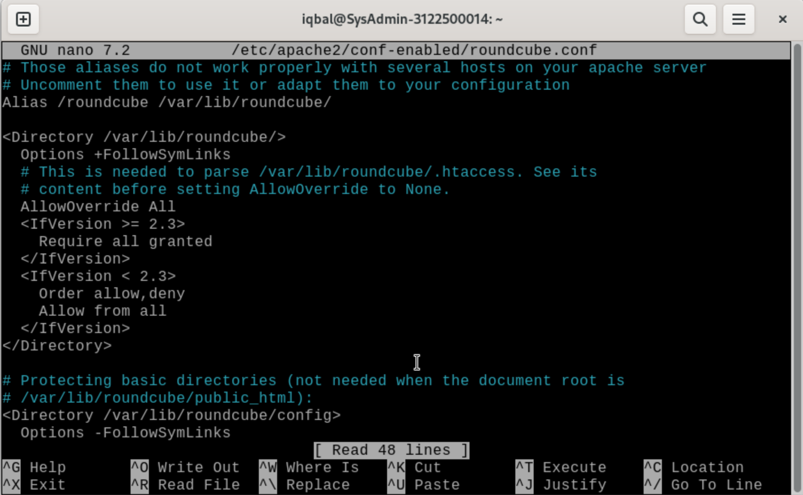
>
> Perintah ini digunakan untuk membuka file konfigurasi roundcube.conf
> dari Apache untuk diedit menggunakan editor nano. File ini berisi
> konfigurasi untuk mengonfigurasi akses ke aplikasi Roundcube melalui
> server web Apache.

8.  sudo systemctl restart apache2

> Ini me-restart layanan Apache setelah mengubah konfigurasi. Ini
> diperlukan agar perubahan konfigurasi yang dilakukan diterapkan dan
> aplikasi Roundcube dapat diakses melalui web server.

9.  Mencoba membuka roundcube di web browser

> 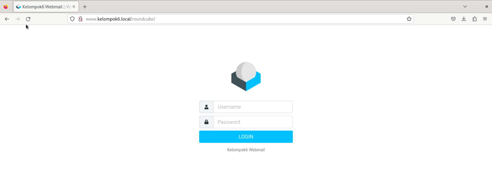 ="width:6.26772in;height:2.16667in" />
>
> 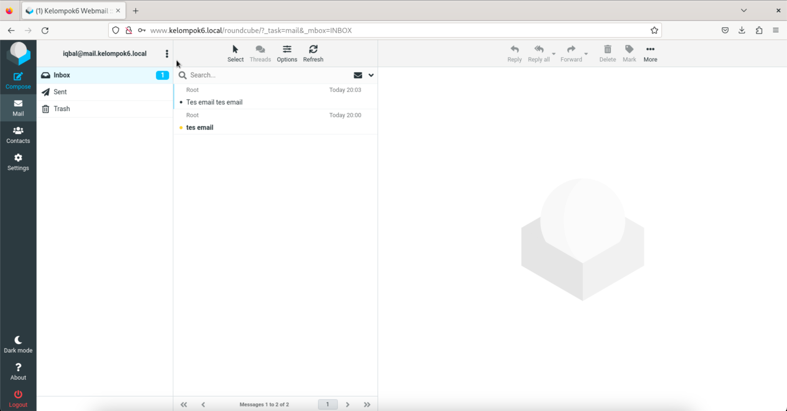 ="width:6.26772in;height:3.27778in" />

10. Mencoba send email

>  ="width:6.26772in;height:2.73611in" />
>
>  ="width:6.26772in;height:0.98611in" />
>
>  ="width:6.26772in;height:2.23611in" />
>
> Lakukan tes melalui web server dengan alamat domain local /roundcube.
> Login menggunakan username dan password yang sudah disetting
> sebelumnya, lalu coba kirim pesan antar user, guna melihat apakah
> round cube sudah berjalan dengan sesuai atau belum. Jika berhasil maka
> message atau pesan antar user bisa terkirim dan terbaca.
