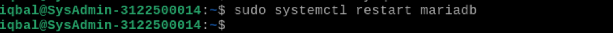

**LAPORAN WORKSHOP ADMINISTRASI JARINGAN**

**Disusun Oleh:**

**Muhammad Iqbal Rahmatullah D3 IT A /3122500014**

**Mohammad Ilham Ramadani D3 IT A /3122500021**

**Rifqi Rayita Dhiyaulhaq D3 IT A /3122500027**

**Dosen Pembimbing :**

**Dr. Ferry Astika Saputra ST, M.Sc**

**Setup Konfigurasi**

Hubungkan kabel ethernet pada device anda

Custom wired dengan menambahkan Address, Netmask, Gateway, dan DNS
secara manual dan sudah ditentukan.

Masuk dalam directory /etc/bind, dan masuk file **named.conf.options**
custom bagian forwaders menjadi dns, localhost, dan alamat ip yang sudah
kita custom sebelumnya. Ubah juga bagian allow-query, dan
allow-recursion yang awalnya internals menjadi any.

Masuk dalam file **/etc/resolv.conf** dan custom NetworkManager,
diantaranya tambahkan search by namakelompok.local, nameserver alamat ip
kelompok, dan juga forwaders.

**Uji Coba**

- **Ping detik.com**

> Kemudian coba ping ke detik.com apakah ada respon balik dari web
> tersebut, jika ada respon maka konfigurasi sudah benar, dan jika belum
> maka matikan firewall terlebih dahulu, agar nantinya bisa dicoba untuk
> ping.

- **Ping kelompok lain**

> Test juga ping ke kelompok lain, dan jika ada respon dari ttl maka
> konfigurasi sudah benar dan terhubung.

- **Nslookup kelompok lain**

> Cek nslookup dari kelompok lain, apakah bisa terhubung atau tidak,
> jika terhubung maka ada answer atau reply dari kelompok1.local dan
> jika tidak maka ada tulisan communicate timed out;;

- **Uji Client-Server**

> Untuk memastikan dan mengujinya sebagai client, Coba hubungkan laptop
> / komputer lain yang terhubung langsung dengan koneksi ethernet. Ping
> ke alamat ip yang sudah di custom sebelumnya. Jika terhubung maka ada
> reply dari laptop/komputer yang dijadikan server

**Test RoundCube**

Lihat bagian inbox, terdapat beberapa user yang sudah berhasil untuk
terhubung dan komunikasi dengan kelompok kamu, yaitu
@mail.kelompok6.local

Gambar di atas adalah contoh pesan dari komunikasi di roundcube.

Coba untuk mencoba kirim pesan antar user yang sudah terhubung

Pesan sukses terkirim

Gambar di atas adalah contoh pesan dari komunikasi di roundcube antara
user dan iqbal.

**Setup DNS Server via Winbox (Mikrotik)**

- Hapus DHCP networks yang sudah terconfig sebelumnya dengan menekan
  tanda (-) yang tertera pada window DHCP Server.

- Atur interface DHCP ke bridge 1

- Atur network DHCP ke 192.168.6.0 dengan netmask 24.

- Atur untuk DHCP ke 192.168.6.1

- Relay isi 0.0.0.0

- Untuk range DHCP address atur pada seluruh address di network
  192.168.6.0 kecuali address untuk gateway dan broadcast.

- Tambahkan DNS Server untuk 10.10.10.1 (DNS Server Mikrotik kita) yang
  awalnya hanya ada satu,192.168.6.10
